# Screenshots

Captured against the test-mode binary via `web/scripts/screenshots-dual-theme.mjs`. Each scene is captured twice — once in the app's light theme, once in dark — at both desktop (1440×900 @ 2x) and mobile (390×844 @ 3x) viewports. The docs site swaps to whichever variant matches the current page theme (via the `.light-only` / `.dark-only` classes in the theme stylesheet) so the screenshot never blends into the page background.

## Three-pane reader

The default layout: sidebar of folders + feeds, the article list, and the reader. Keyboard navigation (`j` / `k` / `r` / `m` / `s` / `?`), drag-to-reorder folders and feeds within them.

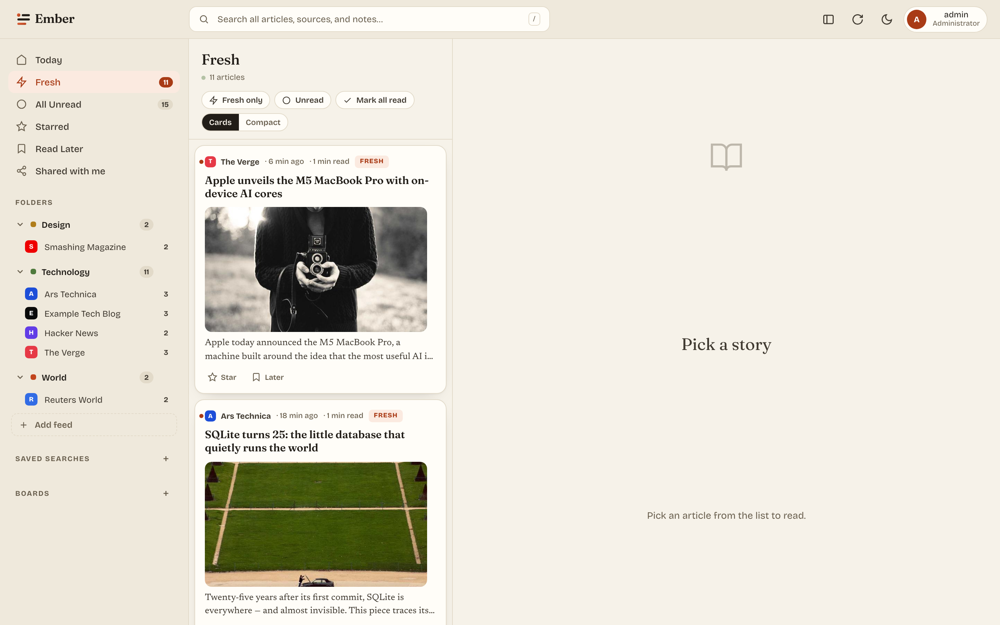
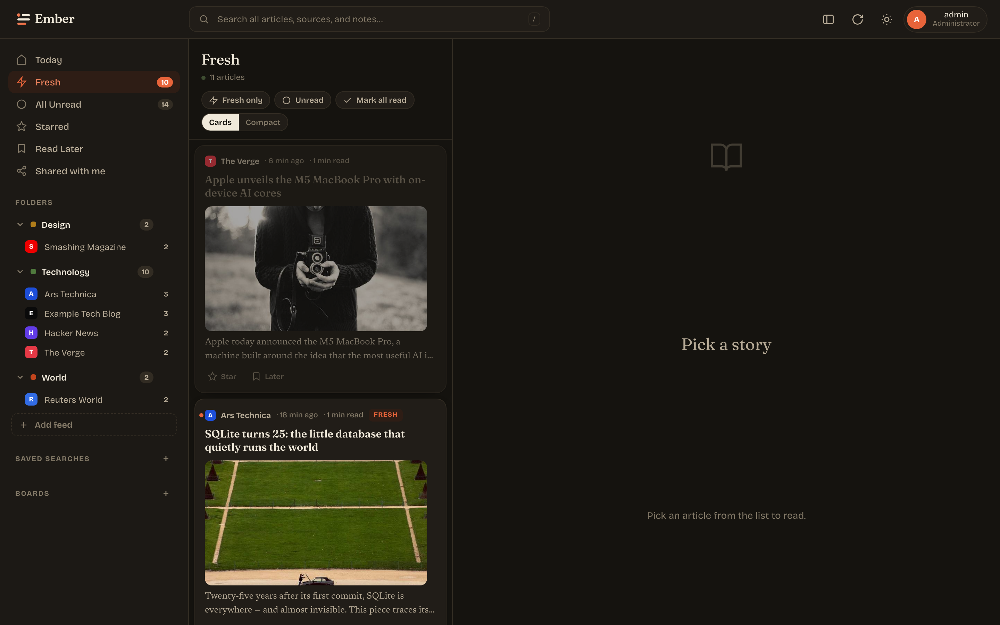

## Article view

Summary card sits between the title and the body — paragraph lead + factual bullets. AI ad-stripping removes newsletter signups, podcast promos, and "Comments" trailers from the body before display.

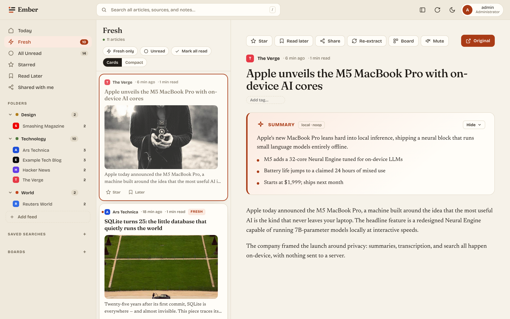
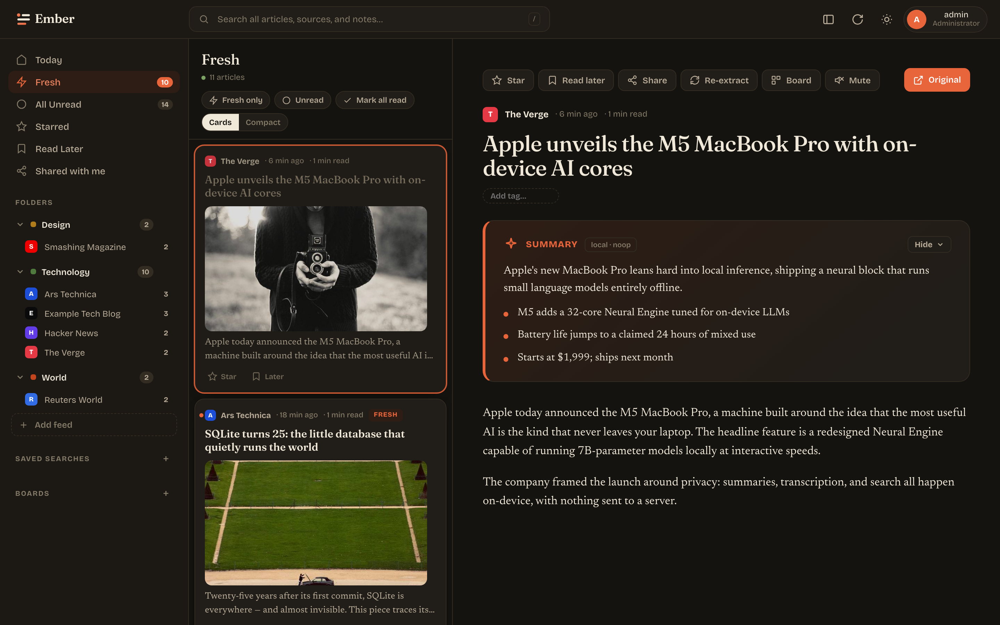

## Settings — preferences

Theme picker (8 presets + custom palette), density toggle, AI summary card on/off.

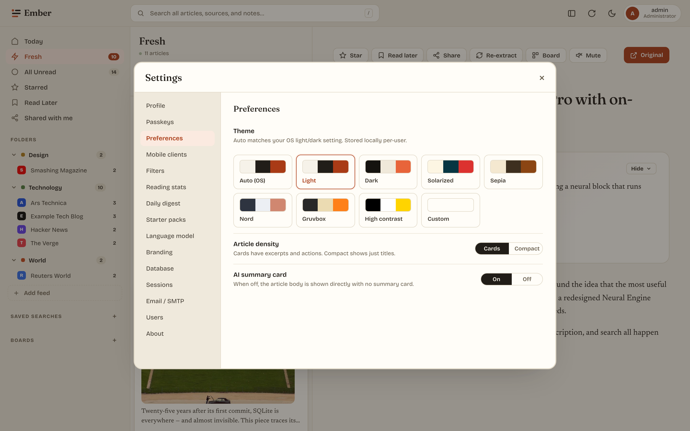
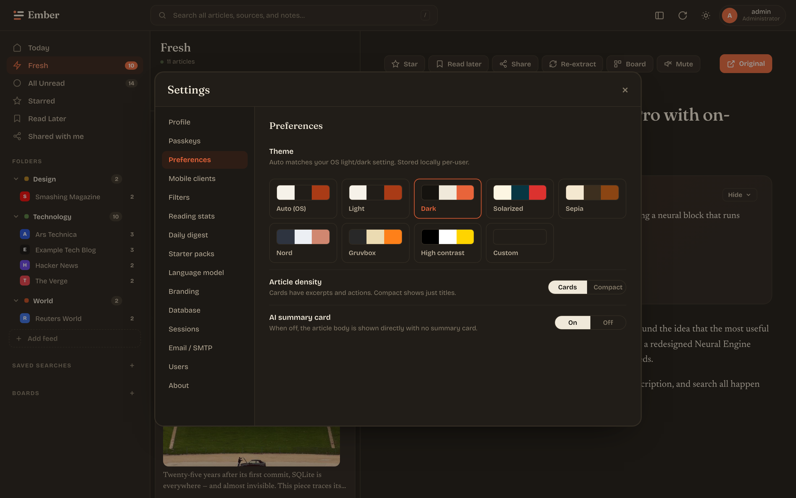

## Settings — language model (admin)

Host probe (RAM/CPU/GPU) with a model recommendation. Installed-model table with per-row switch + delete. Pull form for new models. Sliders for temperature, top_p, num_ctx.

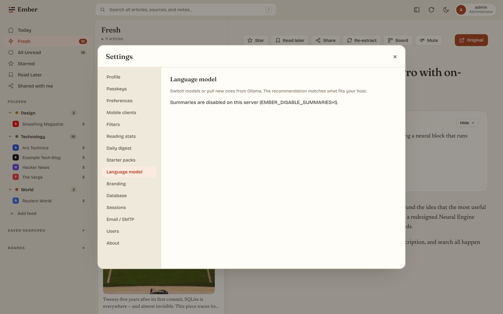
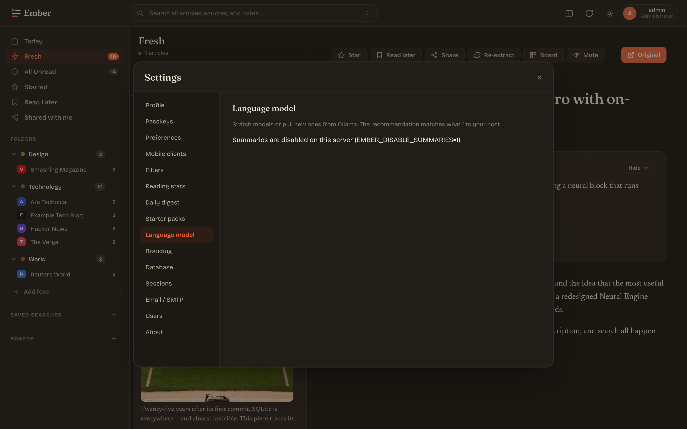

## Settings — email / SMTP (admin)

Overlay the `EMBER_SMTP_*` env defaults with admin-edited values that take effect at runtime (digest sender re-resolves each tick). Send a one-off test email to verify the relay. Below it, the initial-backlog window controls how much history is ingested when a new feed is added.

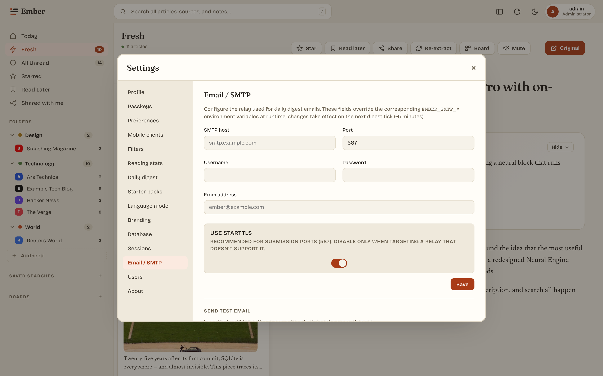
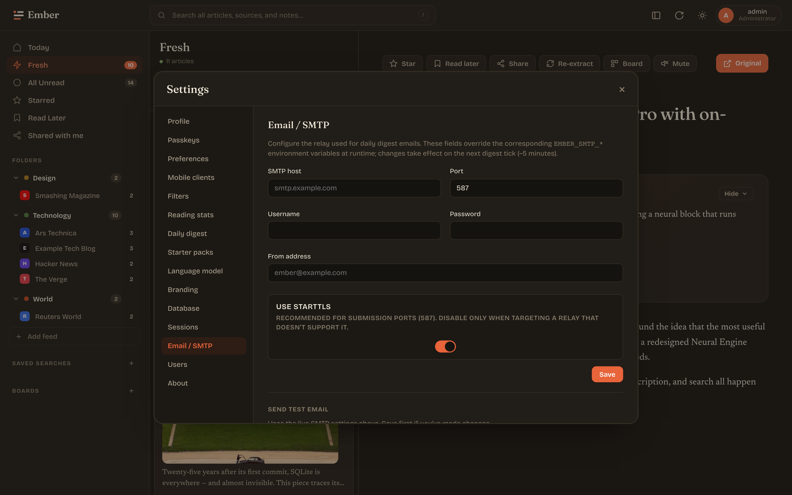

## Login

Paper-and-ink split layout. Branding (app name, page title, favicon) is admin-configurable from Settings → Branding.

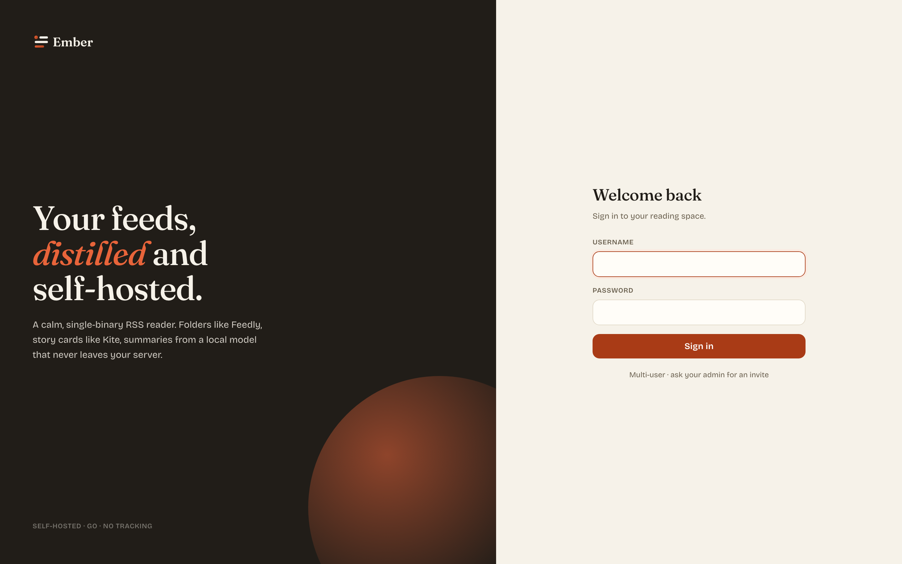
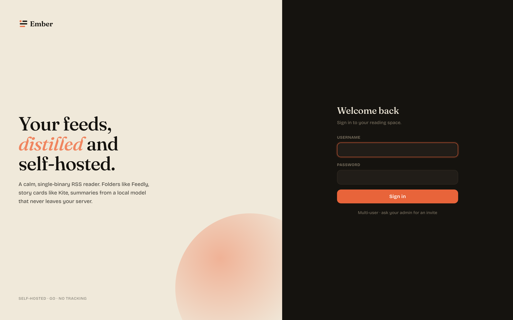

## Mobile

≤900px viewport: sidebar collapses into an off-canvas drawer. Article list and reader take turns at full width — selecting an article switches to the reader; a back arrow returns to the list. Below 520px, the brand text hides so the search bar has room.

<div style="display: grid; grid-template-columns: repeat(auto-fit, minmax(220px, 1fr)); gap: 16px; margin: 24px 0;">

<div>
  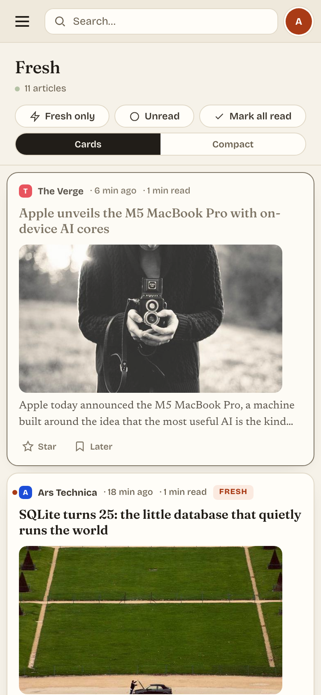
  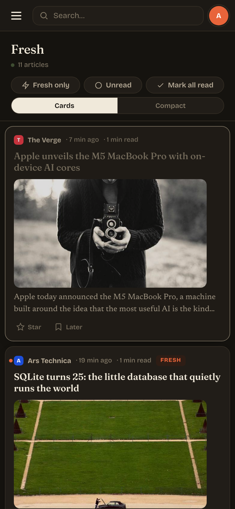
</div>

<div>
  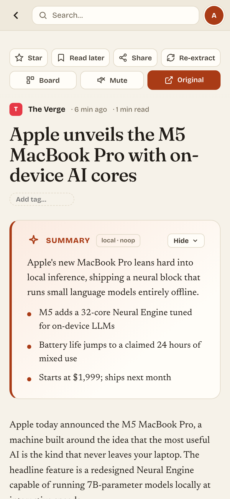
  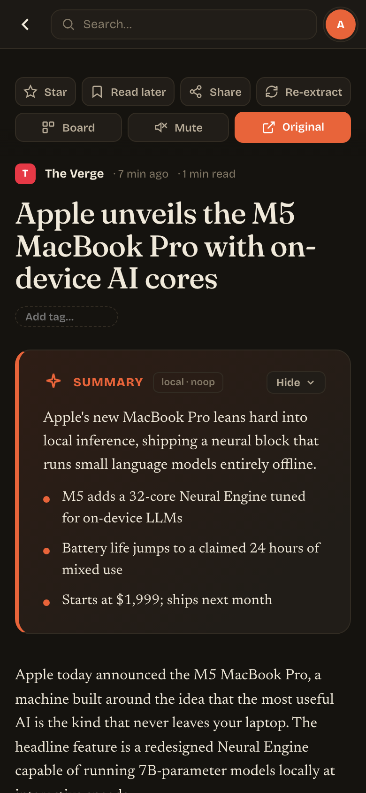
</div>

</div>

## Themes

Eight presets cover light, dark, and accessibility needs. The "Custom" theme lets you pick 3 colors (paper, ink, accent) and the rest of the palette derives via CSS `color-mix()`.

- **Auto** — follows the OS `prefers-color-scheme`.
- **Light** / **Dark** — paper-and-ink defaults.
- **Solarized** — Ethan Schoonover's classic palette.
- **Sepia** — warm browns, e-reader friendly.
- **Nord** — cool blue-gray dark.
- **Gruvbox** — warm-tinted dark by morhetz.
- **High contrast** — black / white / yellow for low-vision users.
- **Custom** — your three colors.

## Regenerating these

```sh
make embed build
EMBER_TEST_MODE=1 EMBER_ADDR=:8083 EMBER_DB_PATH=/tmp/ember-shots.db EMBER_DISABLE_SUMMARIES=1 ./bin/ember &
node web/scripts/screenshots-dual-theme.mjs
kill %1
```

The script walks the test-mode binary through login → reader → article → each settings pane, captures both light and dark themes at two viewports, and writes PNGs into `docs/public/screenshots/`. Commit the result — it's the same as any docs change.
